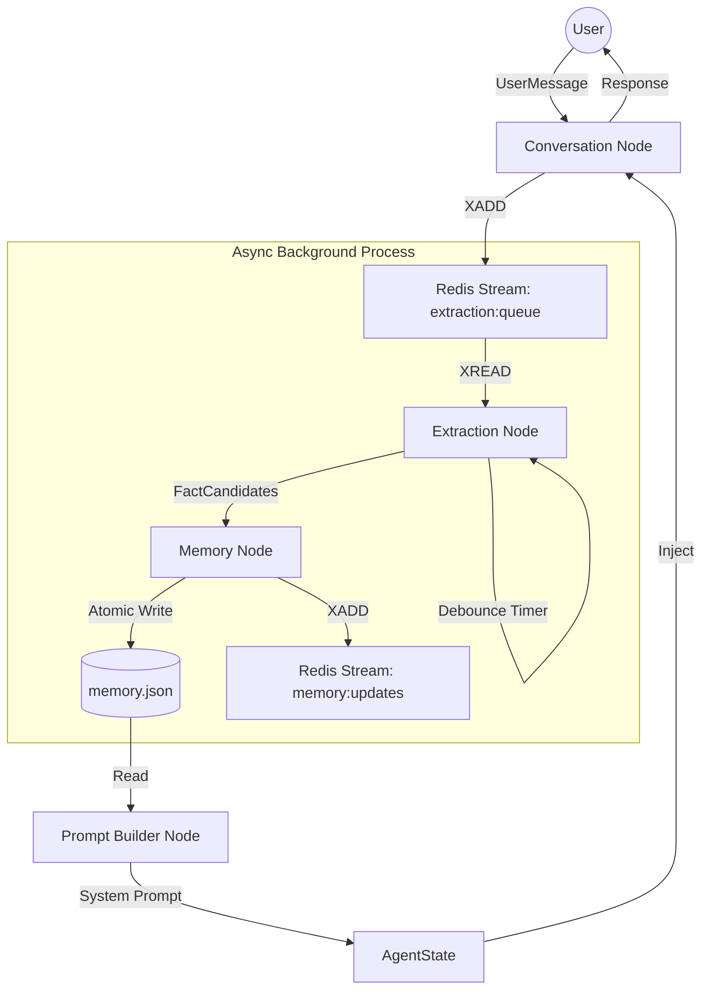

# Multi-Agent Memory System

A production-realistic multi-agent system in Python demonstrating a **six-pattern agent memory architecture**. Built with LangGraph, gpt-4o, Pydantic, and Redis.

## Architecture Overview

The system uses a `StateGraph` where agents communicate via shared state and Redis streams. Memory is persisted in `memory.json` using atomic write patterns.



### The Six Memory Patterns

1.  **Conversation Entry**: Immediate response generation while triggering async background processing.
2.  **Async Extraction Trigger**: Decoupling interaction from memory updates using Redis streams.
3.  **Debounce Extraction**: Aggregating rapid messages (3s window) to reduce LLM overhead.
4.  **Atomic Persistence**: POSIX-compliant `os.replace` rename pattern with thread-level locking.
5.  **Eviction and Filtering**: Confidence-based filtering (0.7) and oldest-lowest-confidence eviction (100-fact cap).
6.  **Context-Aware Prompt Building**: Dynamic system prompt construction with token budget enforcement (2000 tokens).

## Tech Stack

- **Framework**: [LangGraph](https://github.com/langchain-ai/langgraph)
- **LLM**: GPT-4o via `langchain-openai`
- **Schema**: Pydantic v2
- **Queue/State**: Redis (Streams for messaging, Keys for shared state)
- **Persistence**: Atomic JSON file storage

## Project Structure

```text
memory_agent/
  nodes/               # LangGraph agent nodes
    conversation.py    # Pattern 1 & 2
    extraction.py      # Pattern 3
    memory.py          # Pattern 4 & 5
    prompt_builder.py  # Pattern 6
  config.py            # Centralized constants and thresholds
  models.py            # Pydantic V2 schemas
  redis_client.py      # Redis wrapper for streams and KV
  graph.py             # LangGraph workflow definition
  main.py              # 5-Act Demo Scenario
```

## Setup and Run

1.  **Install Dependencies**:
    ```bash
    python3 -m venv venv
    source venv/bin/activate
    pip install -r requirements.txt
    ```

2.  **Configure Environment**:
    Create a `.env` file based on `.env.example`:
    ```text
    OPENAI_API_KEY=your_key_here
    REDIS_URL=redis://localhost:6379
    ```

3.  **Start Redis**:
    Ensure Redis is running locally on port 6379.

4.  **Run the Demo**:
    ```bash
    python3 -m memory_agent.main
    ```

## Technical Verification (AI Engineer's Guide)

The system is validated using a suite of "Acts" in `main.py` that exercise the memory patterns under simulated production conditions.

### ACT 1: Debounce Logic & Redis Stream Aggregation
- **Pattern**: `ExtractionNode` debounce.
- **How we tested it**: 
    - We injected 4 `UserMessage` objects into the `extraction:queue` Redis stream with 500ms intervals.
    - We monkey-patched the `ExtractionManager.process_queue` method to increment a counter.
    - **Mechanism**: The `ExtractionManager` uses a `threading.Timer` that is reset on every new message. If the timer reaches `DEBOUNCE_SECONDS` (3s) without being reset, it triggers a single `XREAD` to consume all pending messages from the stream.
- **Validation**: Asserted `call_count == 1` despite 4 incoming events. Verified Redis stream depth via `XLEN` before and after.

### ACT 2: Pydantic-Driven Confidence Filtering
- **Pattern**: Quality-gate filtering in `MemoryNode`.
- **How we tested it**: 
    - Manually invoked `memory_node_internal` with a list of `FactCandidate` objects containing synthetic confidence scores [0.1, 0.5, 0.8, 0.95].
    - **Mechanism**: Pydantic's `Field(ge=0.0, le=1.0)` ensures schema-level validity, while the node logic applies a functional filter against `config.CONFIDENCE_THRESHOLD`.
- **Validation**: Inspected the resulting `memory.json` to ensure only facts with scores $\ge 0.7$ persisted.

### ACT 3: LRU-style Eviction under Cap Pressure
- **Pattern**: Memory cap management (100-fact limit).
- **How we tested it**: 
    - Seeded the `MemoryStore` with 98 "old" facts (low confidence 0.71, older timestamps).
    - Injected 5 "new" facts with higher confidence (0.85+).
    - **Mechanism**: The eviction logic sorts the combined fact list by `(confidence, timestamp)` ascending and slices the top `N - MAX_FACTS` items. This ensures we keep the most confident and most recent information.
- **Validation**: Asserted `len(facts) == 100`. Verified that the 3 oldest facts were removed by checking their UUIDs against the final store.

### ACT 4: Token-Aware Prompt Orchestration
- **Pattern**: `PromptBuilderNode` budget enforcement.
- **How we tested it**: 
    - Populated memory with 60 facts, each containing large text payloads.
    - **Mechanism**: The builder calculates a running token estimate using a `words * 1.3` heuristic. It injects context and history layers first, then iterates through facts sorted by confidence descending until the `TOKEN_BUDGET` (2000) is hit.
- **Validation**: Asserted final string token count $\le 2000$. Verified that higher-confidence facts appeared earlier in the system prompt.

### ACT 5: Atomic Write Concurrency
- **Pattern**: POSIX `os.replace` + `threading.Lock`.
- **How we tested it**: 
    - Spawned 10 concurrent `threading.Thread` workers, each attempting to write a unique `MemoryStore` payload to the same file.
    - **Mechanism**: Each write acquires a module-level `threading.Lock`, writes to a `.tmp` file, and calls `os.replace()` to perform an atomic rename. This prevents partial writes and ensures that any reader sees either the old version or the new version, never a corrupted one.
- **Validation**: Read the file after all threads joined; verified it parsed as valid JSON and matched exactly one of the thread's payloads.
